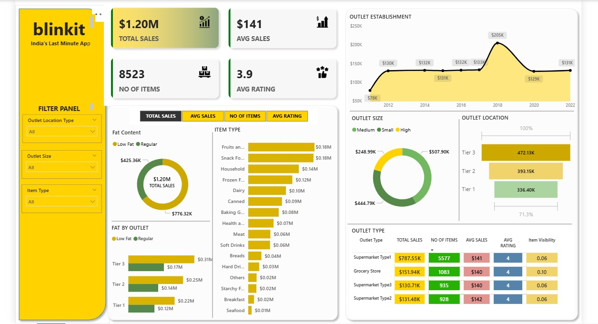

📊 Blinkit Sales Dashboard

🟡 Overview

This dashboard showcases the Sales Performance and Business Insights of Blinkit (India's Last Minute App).
It highlights key KPIs such as Total Sales, Average Sales, Number of Items, and Average Rating, along with detailed breakdowns by Outlet Type, Size, Location, and Item Categories.

🔑 Key Highlights

💰 Total Sales: $1.20M

🛒 Average Sales per Outlet: $141

📦 Number of Items Sold: 8523

⭐ Average Rating: 3.9

📈 Detailed Insights
🔹 Sales by Fat Content

Low Fat: $425.36K

Regular: $776.32K

🔹 Sales by Item Type

Top Performers:

Fruits & Vegetables → $0.18M

Snack Foods → $0.18M

Household → $0.14M

Low Performers:

Seafood → $0.01M

Breakfast → $0.02M

🔹 Outlet Establishment Trend (2012–2022)

Sales started at $78K in 2012

Reached a peak of $205K in 2018

Stabilized around $131K in 2022

🔹 Sales by Outlet Size

Small → $248.99K

Medium → $444.79K

Large (High) → $507.90K

🔹 Sales by Outlet Location

Tier 3 → $472.13K

Tier 2 → $393.15K

Tier 1 → $336.40K

🔹 Sales by Outlet Type
Outlet Type	Total Sales	No. of Items	Avg Sales	Avg Rating	Item Visibility
Supermarket Type1	$787.55K	557	$141	4	0.06
Grocery Store	$151.94K	1083	$140	4	0.10
Supermarket Type3	$130.71K	935	$140	4	0.06
Supermarket Type2	$131.48K	928	$142	4	0.06
🎯 Business Insights

Supermarket Type1 contributes the highest sales ($787.55K).

Tier 3 outlets outperform Tier 1 & Tier 2, indicating higher demand in semi-urban/rural areas.

Regular Fat products dominate sales, but Low Fat is also a strong performer.

Fruits, Vegetables, and Snack Foods are the top-selling categories.

Seafood & Breakfast items have very low sales, signaling potential areas for improvement or promotions.

🚀 Conclusion

Blinkit’s sales are performing strongly with Tier 3 locations and Large Outlets leading growth.
To scale further, the focus should be on:

Boosting low-performing categories (Seafood, Breakfast)

Leveraging high-demand Tier 3 markets

Optimizing item visibility for Grocery stores
